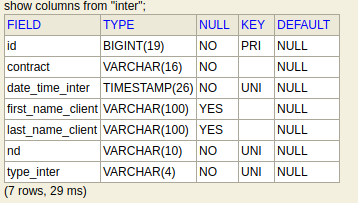

= fiber-console

== Présentation de l'application

L'application a pour but de sauvegarder les interventions sur un support +
indépendant des fournisseurs d'activité. +
Ces fournisseurs d’activité sont en général les opérateurs télécoms ou leurs sous traitant +
entre le technicien et l'opérateur télécom.
Ici nous traitons d'une mise en application métier propre à l’opérateur Orange, +
mais adaptable à d'autres opérateurs, moyennant une étude pour adapter +
le code à la nomenclature de description des articles facturable du domaine métier. +
Un technicien effectue une connexion à la fibre optique et mise en service chez un client d'un opérateur, celui ci peut alors saisir dans l’application l’intervention effectuée(par ex sur son PC portable de travail). +
Une fois les interventions saisies par l’intermédiaire d'une page web, +
délivré par un serveur embarqué dans l'application. +
Les intervention sont consultable dans une page web et stockées, +
dans une base de données en mémoire, donc ne nécessitant aucune installation, +
et nous faisant bénéficier du pouvoir d'interrogation des données +
d'une base de données relationnel. +
Les données stocké en mémoire sont sauvegardées dans un fichier texte(au format json), +
permettant le rechargement des données précédemment saisies, +
lors d'une nouvelle exécution de l'application sur le même poste.
La deuxième fonctionnalité est la génération d'un document excel, +
qui est un récapitulatif des interventions par mois par feuilles d'un classeur excel. +
La troisième fonctionnalité est la mise à disposition d'un API REST, +
permettant a d'autre type de client, de se connecter pour ajouter supprimer +
mettre à jour la liste des interventions et demander un récapitulatif des interventions.

== Schéma relationnel

== API REST

http://localhost:8080/api/inters

## lancer l'application
telecharger le zip ou cloner
se rendre dans le dossier, ouvrir un terminal en se rendant a la racine du projet.
>./gradlew bootRun